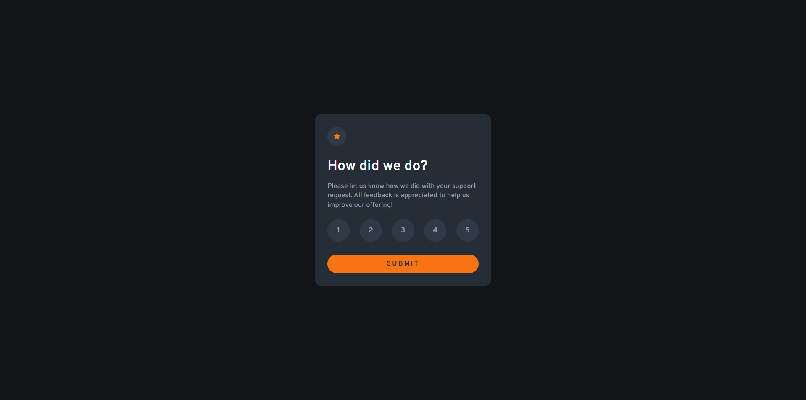
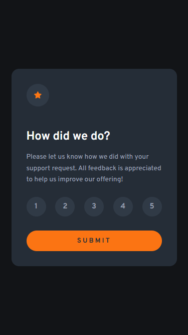

# Tarjeta de calificación interactiva

_"Este proyecto es una propuesta de solución para uno de los desafios de Frontend Mentor, todos los recursos utilizados fueron obtenidos mediante dicha plataforma"_

El siguiente repositorio contempla el desarrollo de una página web en la que se muestra una tarjeta de calificaciones, el usuario debe seleccionar una puntuación del 1 al 5 y enviar esa información para luego mostrarla en detalle.

## Contenidos

- [Descripción](#descripción)
  - [Desafío](#desafío)
  - [Screenshot](#screenshot)
  - [Links](#links)
- [Proceso](#proceso)
  - [Hecho con](#hecho-con)
  - [Lo que aprendí](#lo-que-aprendí)

## Descripción

### Desafío

El desafío propuesto fue obtener desde un formulario la puntuación deseada de la tarjeta, esto utilizando buenas prácticas al momento de escribir el código en términos de diseño y lógica.

### Screenshot

#### Escritorio

#### Movil

### Links

- Sitio: [-](#)

## Proceso

### Hecho con

- HTML
- CSS
  - Flexbox
  - CSS
  - Flujo de trabajo _Mobile-first_
- JavaScript
  - Manejo de DOM y eventos

### Lo que aprendí

Para este desafío solo apliqué conocimientos previos aprendidos, como el manejo de eventos y formularios para la obtención de datos.

También añadí un apartado de verificación en el caso de que el usuario presione el boton de _submit_ sin haber ingresado una puntuación, en palabras simples, se mostrará un texto solicitandole que ingrese la puntuación deseada.